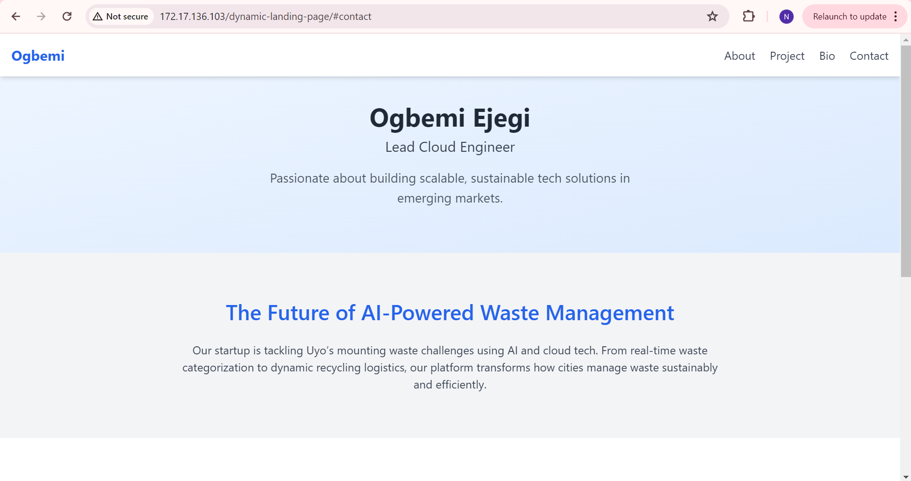

# AltSchool Landing Page – Semester Project

This repository contains the implementation of a dynamic landing page built as part of the second semester AltSchool Cloud Engineering project.

## Project Overview

This project showcases a professionally deployed, responsive landing page enhanced with animations and interactive sections. It is hosted on a Linux server environment using Nginx and was created to demonstrate deployment, system setup, and frontend development skills.

>  Live Project URL: [http://172.17.136.103/dynamic-landing-page/](http://172.17.136.103/dynamic-landing-page/)

---

## Screenshot



---

##Tech Stack

- HTML5 & Tailwind CSS
- AOS.js for animations
- Nginx Web Server
- Git & GitHub for version control
- Ubuntu (WSL2) for local server environment

---

##  Setup & Deployment Steps

### 1. **Install and Configure WSL2**

- Install Ubuntu via WSL2 on Windows
- Update and upgrade system packages
  ```bash
  sudo apt update && sudo apt upgrade -y

# Install and Start Nginx
- sudo apt install nginx -y
- sudo service nginx start

# Project folder structure
/var/www/html/
└── dynamic-landing-page/
    ├── index.html
    └── assets/
        ├── tailwind.min.css
        ├── aos.css
        ├── aos.js
        └── landing-page.png

# Cloning and Configureing the Repo
- git clone git@github.com:ogbemi-ejegi/altschool-landing-page.git
- cd altschool-landing-page

